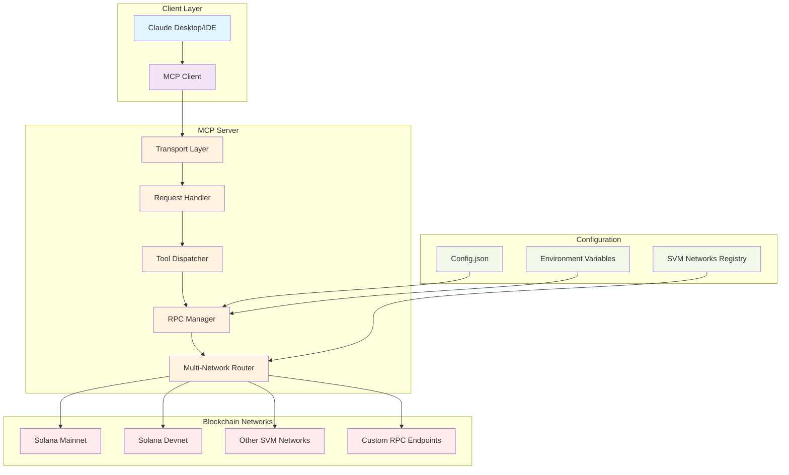
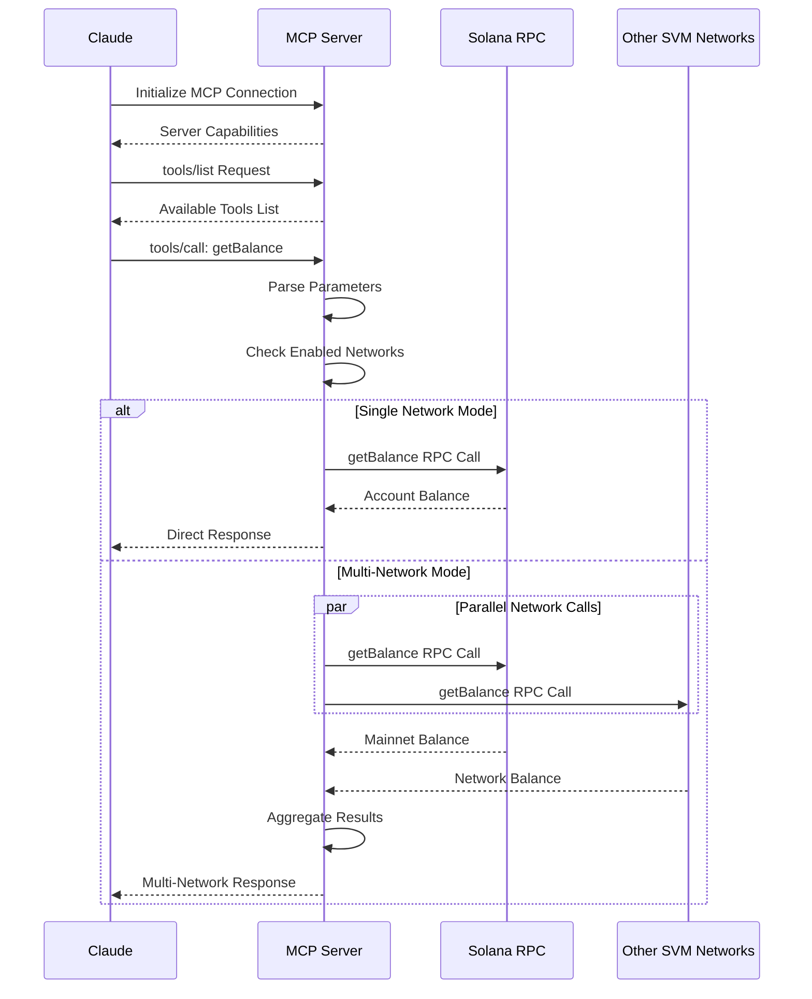
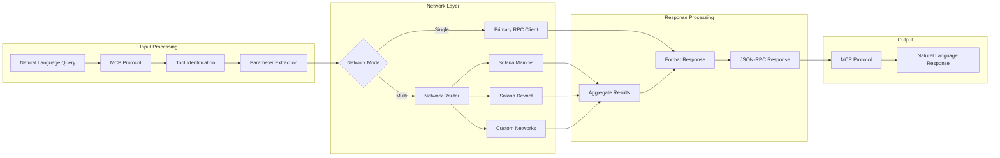
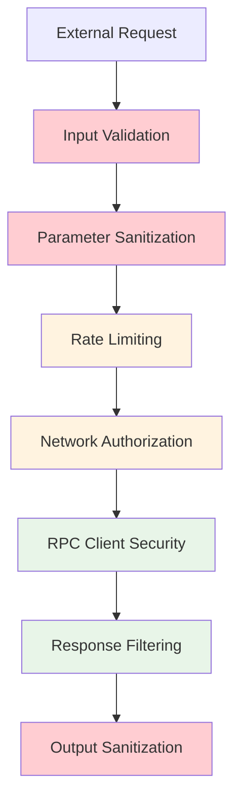

# Solana MCP Server Architecture

## Overview

The Solana MCP Server is a Model Context Protocol (MCP) implementation that provides comprehensive access to Solana blockchain data through AI assistants like Claude. It acts as a bridge between natural language conversations and Solana RPC endpoints, enabling users to query blockchain information conversationally.

## System Architecture



## Core Components

### 1. Transport Layer
- **Protocol**: JSON-RPC 2.0 over stdio
- **Communication**: Bidirectional message passing
- **Serialization**: JSON with serde
- **Error Handling**: Structured error responses with protocol version

### 2. Request Handler
- **Initialization**: MCP protocol handshake
- **Tool Discovery**: Dynamic tool listing
- **Request Routing**: Method-based dispatch
- **Response Formatting**: Standardized JSON-RPC responses

### 3. Multi-Network Router
- **Network Management**: Dynamic SVM network configuration
- **Load Balancing**: Parallel requests across enabled networks
- **Result Aggregation**: Unified response format for multi-network queries
- **Fallback Handling**: Graceful degradation on network failures

### 4. RPC Manager
- **Client Pool**: Persistent Solana RPC client connections
- **Commitment Levels**: Configurable transaction confirmation levels
- **Rate Limiting**: Built-in request throttling
- **Error Recovery**: Automatic retry mechanisms

## Request Flow



## Data Flow Architecture



## Multi-Network Support

The server supports querying multiple SVM-compatible networks simultaneously:

### Network Configuration
```json
{
  "svm_networks": {
    "solana-mainnet": {
      "name": "Solana Mainnet",
      "rpc_url": "https://api.mainnet-beta.solana.com",
      "enabled": true
    },
    "solana-devnet": {
      "name": "Solana Devnet", 
      "rpc_url": "https://api.devnet.solana.com",
      "enabled": false
    }
  }
}
```

### Response Formats

**Single Network Response:**
```json
{
  "value": 1000000000,
  "context": {
    "slot": 12345
  }
}
```

**Multi-Network Response:**
```json
{
  "solana-mainnet": {
    "value": 1000000000,
    "context": { "slot": 12345 }
  },
  "custom-network": {
    "value": 500000000,
    "context": { "slot": 12340 }
  }
}
```

## Security Model



### Security Features
- **Input Validation**: Strict parameter type checking
- **Rate Limiting**: Prevents RPC endpoint abuse
- **Network Isolation**: Sandboxed network configurations
- **Error Sanitization**: Prevents information leakage
- **Read-Only Operations**: No transaction signing or sending by default

## Performance Characteristics

### Latency Profile
- **Local Processing**: < 1ms
- **Single Network RPC**: 100-500ms (network dependent)
- **Multi-Network Queries**: 200-800ms (parallel execution)
- **Network Discovery**: 1-3s (cached after first load)

### Scalability
- **Concurrent Requests**: Limited by RPC endpoint rate limits
- **Memory Usage**: ~10MB base + ~2MB per active network
- **CPU Usage**: Minimal for request routing and JSON processing

### Optimization Features
- **Connection Pooling**: Persistent RPC client connections
- **Response Caching**: Configurable caching for static data
- **Parallel Execution**: Simultaneous multi-network queries
- **Lazy Loading**: Networks initialized on first use