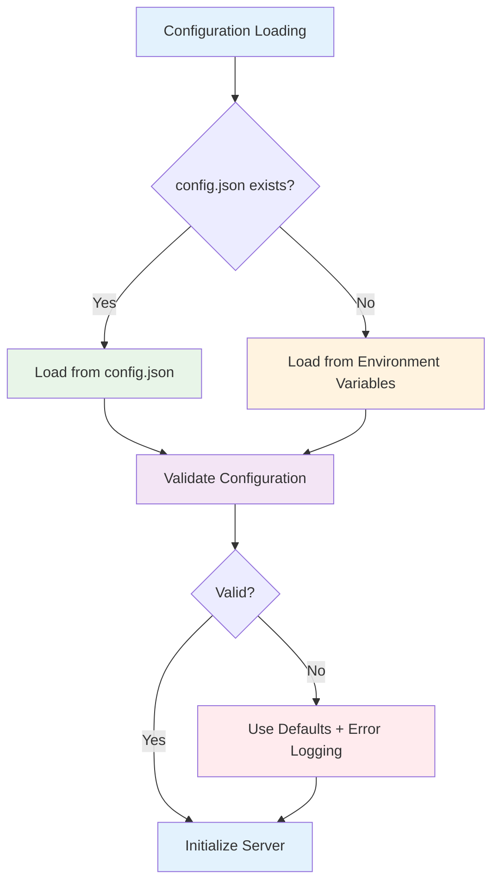
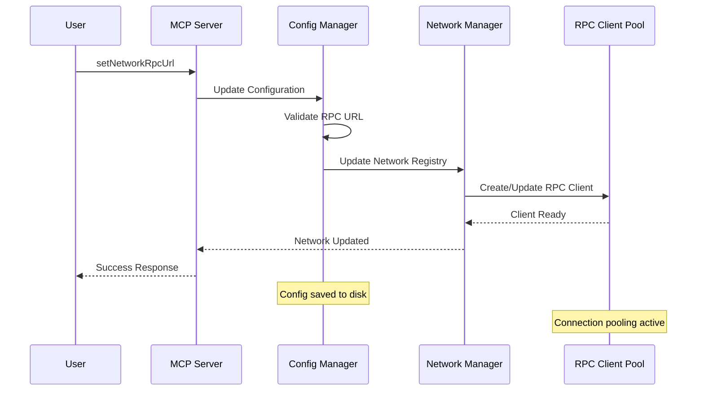
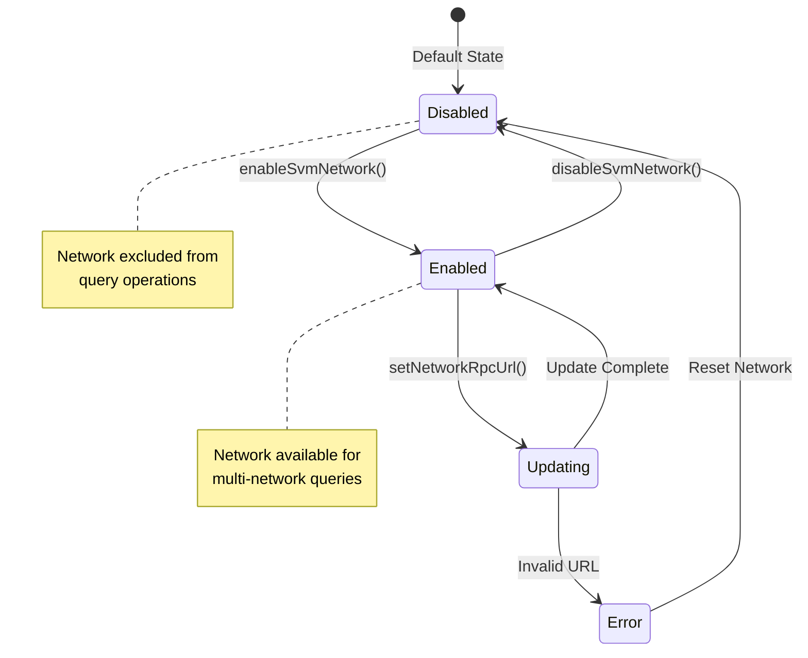

# Configuration Guide

## Overview

The Solana MCP Server supports flexible configuration through multiple sources with a clear precedence hierarchy. This guide covers all configuration options, formats, and best practices.

## Configuration Sources



## Configuration Hierarchy

1. **config.json** (highest priority)
2. **Environment Variables** (fallback)
3. **Default Values** (last resort)

## Configuration File Format

### Basic Configuration

```json
{
  "rpc_url": "https://api.mainnet-beta.solana.com",
  "commitment": "confirmed",
  "protocol_version": "2024-11-05"
}
```

### Complete Configuration

```json
{
  "rpc_url": "https://api.mainnet-beta.solana.com",
  "commitment": "confirmed",
  "protocol_version": "2024-11-05",
  "svm_networks": {
    "solana-mainnet": {
      "name": "Solana Mainnet",
      "rpc_url": "https://api.mainnet-beta.solana.com",
      "enabled": true
    },
    "solana-devnet": {
      "name": "Solana Devnet",
      "rpc_url": "https://api.devnet.solana.com",
      "enabled": false
    },
    "eclipse-mainnet": {
      "name": "Eclipse Mainnet",
      "rpc_url": "https://mainnetbeta-rpc.eclipse.xyz",
      "enabled": false
    },
    "custom-network": {
      "name": "Custom Development Network",
      "rpc_url": "https://my-custom-rpc.example.com",
      "enabled": false
    }
  },
  "server_config": {
    "max_concurrent_requests": 100,
    "request_timeout_ms": 30000,
    "retry_attempts": 3,
    "retry_delay_ms": 1000,
    "enable_logging": true,
    "log_level": "info"
  },
  "cache_config": {
    "enable_caching": true,
    "cache_ttl_seconds": 300,
    "max_cache_size": 1000
  }
}
```

## Environment Variables

### Core Settings

```bash
# Primary RPC endpoint
export SOLANA_RPC_URL="https://api.mainnet-beta.solana.com"

# Commitment level (processed|confirmed|finalized)
export SOLANA_COMMITMENT="confirmed"

# Protocol version
export SOLANA_PROTOCOL_VERSION="2024-11-05"

# Logging level
export RUST_LOG="info"
```

### Network Configuration

```bash
# Enable specific networks
export SOLANA_ENABLED_NETWORKS="solana-mainnet,eclipse-mainnet"

# Custom RPC URLs
export SOLANA_MAINNET_RPC="https://api.mainnet-beta.solana.com"
export ECLIPSE_MAINNET_RPC="https://mainnetbeta-rpc.eclipse.xyz"

# Network-specific settings
export SOLANA_DEVNET_ENABLED="false"
export ECLIPSE_TESTNET_ENABLED="true"
```

### Performance Settings

```bash
# Request handling
export MAX_CONCURRENT_REQUESTS="100"
export REQUEST_TIMEOUT_MS="30000"
export RETRY_ATTEMPTS="3"

# Caching
export ENABLE_CACHING="true"
export CACHE_TTL_SECONDS="300"
export MAX_CACHE_SIZE="1000"

# Connection pooling
export CONNECTION_POOL_SIZE="10"
export CONNECTION_TIMEOUT_MS="5000"
```

## Network Management

### Adding New Networks

1. **Via Configuration File:**
```json
{
  "svm_networks": {
    "new-network": {
      "name": "New SVM Network",
      "rpc_url": "https://rpc.new-network.com",
      "enabled": false
    }
  }
}
```

2. **Via API Call:**
```json
{
  "method": "setNetworkRpcUrl",
  "params": {
    "network_id": "new-network",
    "rpc_url": "https://rpc.new-network.com"
  }
}
```

### Network Configuration Flow



### Network States



## Configuration Validation

### Validation Rules

```rust
// Configuration validation schema
pub struct ConfigValidator;

impl ConfigValidator {
    pub fn validate(config: &Config) -> Result<(), ConfigError> {
        // Validate RPC URL format
        if !Self::is_valid_url(&config.rpc_url) {
            return Err(ConfigError::InvalidRpcUrl(config.rpc_url.clone()));
        }
        
        // Validate commitment level
        if !["processed", "confirmed", "finalized"].contains(&config.commitment.as_str()) {
            return Err(ConfigError::InvalidCommitment(config.commitment.clone()));
        }
        
        // Validate protocol version format
        if !Self::is_valid_protocol_version(&config.protocol_version) {
            return Err(ConfigError::InvalidProtocolVersion(config.protocol_version.clone()));
        }
        
        // Validate SVM networks
        for (id, network) in &config.svm_networks {
            if !Self::is_valid_url(&network.rpc_url) {
                return Err(ConfigError::InvalidNetworkRpcUrl {
                    network_id: id.clone(),
                    url: network.rpc_url.clone(),
                });
            }
        }
        
        Ok(())
    }
}
```

### Validation Errors

```json
{
  "error": {
    "code": -32603,
    "message": "Configuration validation failed",
    "data": {
      "errors": [
        {
          "field": "svm_networks.custom-network.rpc_url",
          "message": "Invalid URL format",
          "value": "invalid-url"
        }
      ]
    }
  }
}
```

## Security Configuration

### Access Control

```json
{
  "security_config": {
    "allowed_origins": [
      "https://claude.ai",
      "https://localhost:3000"
    ],
    "rate_limiting": {
      "requests_per_minute": 100,
      "burst_limit": 10
    },
    "authentication": {
      "require_api_key": false,
      "api_key_header": "X-API-Key"
    }
  }
}
```

### Network Security

```json
{
  "network_security": {
    "verify_ssl": true,
    "connection_timeout_ms": 5000,
    "read_timeout_ms": 30000,
    "max_redirects": 3,
    "user_agent": "solana-mcp-server/1.0.0"
  }
}
```

## Performance Configuration

### Connection Pooling

```json
{
  "connection_pool": {
    "max_connections_per_host": 10,
    "max_idle_connections": 5,
    "idle_timeout_seconds": 300,
    "connection_ttl_seconds": 3600
  }
}
```

### Caching Strategy

```json
{
  "cache_config": {
    "enable_caching": true,
    "cache_layers": {
      "network_info": {
        "ttl_seconds": 3600,
        "max_entries": 100
      },
      "account_info": {
        "ttl_seconds": 30,
        "max_entries": 1000
      },
      "block_info": {
        "ttl_seconds": 600,
        "max_entries": 500
      }
    }
  }
}
```

## Development Configuration

### Local Development

```json
{
  "rpc_url": "https://api.devnet.solana.com",
  "commitment": "processed",
  "svm_networks": {
    "solana-devnet": {
      "name": "Solana Devnet",
      "rpc_url": "https://api.devnet.solana.com",
      "enabled": true
    }
  },
  "server_config": {
    "enable_logging": true,
    "log_level": "debug",
    "request_timeout_ms": 10000
  }
}
```

### Testing Configuration

```json
{
  "rpc_url": "https://api.testnet.solana.com",
  "commitment": "confirmed",
  "server_config": {
    "max_concurrent_requests": 50,
    "retry_attempts": 1,
    "enable_logging": true,
    "log_level": "trace"
  },
  "cache_config": {
    "enable_caching": false
  }
}
```

## Production Configuration

### High Performance

```json
{
  "rpc_url": "https://api.mainnet-beta.solana.com",
  "commitment": "confirmed",
  "svm_networks": {
    "solana-mainnet": {
      "name": "Solana Mainnet",
      "rpc_url": "https://my-dedicated-rpc.example.com",
      "enabled": true
    }
  },
  "server_config": {
    "max_concurrent_requests": 500,
    "request_timeout_ms": 15000,
    "retry_attempts": 2,
    "enable_logging": true,
    "log_level": "warn"
  },
  "connection_pool": {
    "max_connections_per_host": 20,
    "connection_ttl_seconds": 1800
  },
  "cache_config": {
    "enable_caching": true,
    "cache_ttl_seconds": 120,
    "max_cache_size": 5000
  }
}
```

### High Availability

```json
{
  "rpc_url": "https://api.mainnet-beta.solana.com",
  "svm_networks": {
    "solana-mainnet-primary": {
      "name": "Solana Mainnet (Primary)",
      "rpc_url": "https://primary-rpc.example.com",
      "enabled": true
    },
    "solana-mainnet-backup": {
      "name": "Solana Mainnet (Backup)",
      "rpc_url": "https://backup-rpc.example.com",
      "enabled": true
    }
  },
  "fallback_config": {
    "enable_fallback": true,
    "fallback_threshold_ms": 5000,
    "health_check_interval_seconds": 30
  }
}
```

## Configuration Management Commands

### Runtime Configuration Updates

```bash
# Update primary RPC URL
solana-mcp-server config set rpc_url "https://new-rpc.example.com"

# Enable network
solana-mcp-server config network enable "eclipse-mainnet"

# Set network RPC URL
solana-mcp-server config network set-url "eclipse-mainnet" "https://custom-rpc.com"

# View current configuration
solana-mcp-server config show

# Validate configuration
solana-mcp-server config validate
```

### Configuration Backup and Restore

```bash
# Backup current configuration
solana-mcp-server config backup config-backup.json

# Restore from backup
solana-mcp-server config restore config-backup.json

# Reset to defaults
solana-mcp-server config reset
```

## Troubleshooting

### Common Configuration Issues

1. **Invalid RPC URL Format**
   ```
   Error: Invalid RPC URL format: 'not-a-url'
   Solution: Use full HTTP/HTTPS URLs
   ```

2. **Network Connectivity Issues**
   ```
   Error: Failed to connect to RPC endpoint
   Solution: Check network connectivity and URL accessibility
   ```

3. **Configuration File Syntax Errors**
   ```
   Error: Failed to parse config.json: invalid JSON
   Solution: Validate JSON syntax
   ```

### Configuration Validation Tool

```bash
# Validate configuration file
jq empty config.json && echo "Valid JSON" || echo "Invalid JSON"

# Test RPC connectivity
curl -X POST -H "Content-Type: application/json" \
  --data '{"jsonrpc":"2.0","id":1,"method":"getHealth"}' \
  https://api.mainnet-beta.solana.com
```

### Debug Configuration Loading

```bash
# Enable debug logging for configuration loading
RUST_LOG=solana_mcp_server::config=debug solana-mcp-server

# Check which configuration source is being used
solana-mcp-server --config-info
```