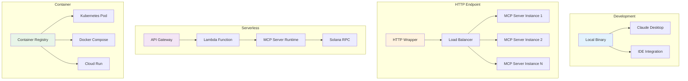

# Deployment Guide

## Overview

This guide covers multiple deployment strategies for the Solana MCP Server, from local development to production serverless deployments and HTTP endpoints.

## Deployment Architecture



## Local Development

### Quick Start
```bash
# Download and configure in one command
curl -s https://api.github.com/repos/opensvm/solana-mcp-server/releases/latest | \
grep browser_download_url | grep $(uname -s | tr '[:upper:]' '[:lower:]') | \
cut -d '"' -f 4 | xargs curl -L -o solana-mcp-server && \
chmod +x solana-mcp-server && \
mkdir -p ~/.config/claude && \
echo '{"mcpServers":{"solana":{"command":"'$(pwd)'/solana-mcp-server","env":{"SOLANA_RPC_URL":"https://api.mainnet-beta.solana.com"}}}}' > ~/.config/claude/config.json
```

### Manual Configuration

1. **Download Binary**
```bash
# Linux
wget https://github.com/opensvm/solana-mcp-server/releases/latest/download/solana-mcp-server-linux-amd64
chmod +x solana-mcp-server-linux-amd64

# macOS
wget https://github.com/opensvm/solana-mcp-server/releases/latest/download/solana-mcp-server-macos-amd64
chmod +x solana-mcp-server-macos-amd64
```

2. **Configure Claude Desktop**
```json
{
  "mcpServers": {
    "solana": {
      "command": "/path/to/solana-mcp-server",
      "env": {
        "SOLANA_RPC_URL": "https://api.mainnet-beta.solana.com",
        "SOLANA_COMMITMENT": "confirmed"
      }
    }
  }
}
```

## HTTP Endpoint Deployment

### Creating HTTP Wrapper

Create a HTTP server that wraps the MCP server:

```rust
// src/http_server.rs
use axum::{
    extract::{Json, State},
    http::StatusCode,
    response::Json as ResponseJson,
    routing::post,
    Router,
};
use serde_json::Value;
use std::sync::Arc;
use tokio::sync::RwLock;
use crate::server::ServerState;
use crate::tools;

#[derive(Clone)]
pub struct AppState {
    pub server_state: Arc<RwLock<ServerState>>,
}

pub async fn create_app() -> Router {
    let config = crate::Config::load().unwrap();
    let server_state = Arc::new(RwLock::new(ServerState::new(config)));
    let app_state = AppState { server_state };
    
    Router::new()
        .route("/rpc", post(handle_rpc))
        .route("/health", axum::routing::get(health_check))
        .with_state(app_state)
}

async fn handle_rpc(
    State(state): State<AppState>,
    Json(payload): Json<Value>,
) -> Result<ResponseJson<Value>, StatusCode> {
    match tools::handle_request(&payload.to_string(), state.server_state).await {
        Ok(response) => Ok(ResponseJson(response)),
        Err(_) => Err(StatusCode::INTERNAL_SERVER_ERROR),
    }
}

async fn health_check() -> &'static str {
    "OK"
}
```

### Docker Configuration

```dockerfile
# Dockerfile
FROM rust:1.75 as builder

WORKDIR /app
COPY . .
RUN cargo build --release --features http-server

FROM debian:bookworm-slim
RUN apt-get update && apt-get install -y \
    ca-certificates \
    && rm -rf /var/lib/apt/lists/*

COPY --from=builder /app/target/release/solana-mcp-server /usr/local/bin/
EXPOSE 8080

CMD ["solana-mcp-server", "--http", "--port", "8080"]
```

### Docker Compose

```yaml
# docker-compose.yml
version: '3.8'
services:
  solana-mcp:
    build: .
    ports:
      - "8080:8080"
    environment:
      - SOLANA_RPC_URL=https://api.mainnet-beta.solana.com
      - SOLANA_COMMITMENT=confirmed
      - RUST_LOG=info
    restart: unless-stopped
    healthcheck:
      test: ["CMD", "curl", "-f", "http://localhost:8080/health"]
      interval: 30s
      timeout: 10s
      retries: 3
  
  nginx:
    image: nginx:alpine
    ports:
      - "80:80"
      - "443:443"
    volumes:
      - ./nginx.conf:/etc/nginx/nginx.conf
    depends_on:
      - solana-mcp
```

### Kubernetes Deployment

```yaml
# k8s-deployment.yaml
apiVersion: apps/v1
kind: Deployment
metadata:
  name: solana-mcp-server
spec:
  replicas: 3
  selector:
    matchLabels:
      app: solana-mcp-server
  template:
    metadata:
      labels:
        app: solana-mcp-server
    spec:
      containers:
      - name: solana-mcp-server
        image: solana-mcp-server:latest
        ports:
        - containerPort: 8080
        env:
        - name: SOLANA_RPC_URL
          value: "https://api.mainnet-beta.solana.com"
        resources:
          requests:
            memory: "64Mi"
            cpu: "250m"
          limits:
            memory: "128Mi"
            cpu: "500m"
        livenessProbe:
          httpGet:
            path: /health
            port: 8080
          initialDelaySeconds: 30
          periodSeconds: 10
---
apiVersion: v1
kind: Service
metadata:
  name: solana-mcp-service
spec:
  selector:
    app: solana-mcp-server
  ports:
  - protocol: TCP
    port: 80
    targetPort: 8080
  type: LoadBalancer
```

## Serverless Deployment

### AWS Lambda

#### Lambda Handler
```rust
// src/lambda.rs
use lambda_runtime::{run, service_fn, Error, LambdaEvent};
use serde_json::{json, Value};
use crate::server::ServerState;
use crate::tools;
use std::sync::Arc;
use tokio::sync::RwLock;

async fn function_handler(event: LambdaEvent<Value>) -> Result<Value, Error> {
    let config = crate::Config::load()?;
    let state = Arc::new(RwLock::new(ServerState::new(config)));
    
    let response = tools::handle_request(
        &event.payload.to_string(),
        state
    ).await?;
    
    Ok(response)
}

#[tokio::main]
async fn main() -> Result<(), Error> {
    run(service_fn(function_handler)).await
}
```

#### Serverless Framework Configuration
```yaml
# serverless.yml
service: solana-mcp-server

provider:
  name: aws
  runtime: provided.al2
  region: us-east-1
  timeout: 30
  memorySize: 256
  environment:
    SOLANA_RPC_URL: https://api.mainnet-beta.solana.com
    RUST_LOG: info

functions:
  solana-mcp:
    handler: bootstrap
    events:
      - httpApi:
          path: /rpc
          method: post
      - httpApi:
          path: /health
          method: get

plugins:
  - serverless-rust

custom:
  rust:
    dockerTag: 'provided.al2'
```

#### Build Script
```bash
#!/bin/bash
# build-lambda.sh

# Install cargo-lambda if not present
cargo install cargo-lambda

# Build for Lambda
cargo lambda build --release

# Package for deployment
cp target/lambda/solana-mcp-server/bootstrap .
zip lambda-deployment.zip bootstrap

echo "Lambda package ready: lambda-deployment.zip"
```

### Google Cloud Functions

```rust
// src/gcf.rs
use functions_framework::http::{HttpRequest, HttpResponse};
use serde_json::Value;
use std::sync::Arc;
use tokio::sync::RwLock;

#[functions_framework::http]
async fn solana_mcp_handler(req: HttpRequest) -> Result<HttpResponse, Box<dyn std::error::Error>> {
    let body: Value = serde_json::from_slice(&req.into_body())?;
    
    let config = crate::Config::load()?;
    let state = Arc::new(RwLock::new(crate::server::ServerState::new(config)));
    
    let response = crate::tools::handle_request(&body.to_string(), state).await?;
    
    Ok(HttpResponse::builder()
        .status(200)
        .header("content-type", "application/json")
        .body(serde_json::to_string(&response)?)?)
}
```

### Vercel Edge Functions

```rust
// api/solana-mcp.rs
use vercel_runtime::{run, Body, Error, Request, Response};
use serde_json::Value;

#[tokio::main]
async fn main() -> Result<(), Error> {
    run(handler).await
}

pub async fn handler(req: Request) -> Result<Response<Body>, Error> {
    let body = req.body();
    let payload: Value = serde_json::from_slice(body)?;
    
    // Initialize MCP server state
    let config = solana_mcp_server::Config::load().map_err(|e| {
        Error::from(format!("Config error: {}", e))
    })?;
    
    let state = std::sync::Arc::new(tokio::sync::RwLock::new(
        solana_mcp_server::server::ServerState::new(config)
    ));
    
    let response = solana_mcp_server::tools::handle_request(
        &payload.to_string(),
        state
    ).await.map_err(|e| Error::from(format!("Handler error: {}", e)))?;
    
    Ok(Response::builder()
        .status(200)
        .header("content-type", "application/json")
        .body(serde_json::to_string(&response)?.into())?)
}
```

## Configuration Management

### Environment-Based Configuration

```bash
# Production environment variables
export SOLANA_RPC_URL=https://api.mainnet-beta.solana.com
export SOLANA_COMMITMENT=confirmed
export SOLANA_PROTOCOL_VERSION=2024-11-05
export RUST_LOG=info
export SERVER_PORT=8080
export MAX_CONCURRENT_REQUESTS=100
```

### Configuration File

```json
{
  "rpc_url": "https://api.mainnet-beta.solana.com",
  "commitment": "confirmed",
  "protocol_version": "2024-11-05",
  "svm_networks": {
    "solana-mainnet": {
      "name": "Solana Mainnet",
      "rpc_url": "https://api.mainnet-beta.solana.com",
      "enabled": true
    },
    "solana-devnet": {
      "name": "Solana Devnet",
      "rpc_url": "https://api.devnet.solana.com",
      "enabled": false
    },
    "eclipse-mainnet": {
      "name": "Eclipse Mainnet",
      "rpc_url": "https://mainnetbeta-rpc.eclipse.xyz",
      "enabled": false
    }
  },
  "server_config": {
    "port": 8080,
    "max_concurrent_requests": 100,
    "request_timeout_ms": 30000,
    "enable_cors": true,
    "enable_metrics": true
  }
}
```

## Monitoring and Observability

### Health Checks

```rust
// Health check endpoint
async fn health_check(State(state): State<AppState>) -> Result<Json<Value>, StatusCode> {
    let server_state = state.server_state.read().await;
    
    // Check RPC connectivity
    let health_status = match server_state.rpc_client.get_health().await {
        Ok(_) => "healthy",
        Err(_) => "unhealthy",
    };
    
    Ok(Json(json!({
        "status": health_status,
        "timestamp": chrono::Utc::now().to_rfc3339(),
        "version": env!("CARGO_PKG_VERSION"),
        "enabled_networks": server_state.get_enabled_networks(),
    })))
}
```

### Metrics Collection

```rust
// Prometheus metrics
use prometheus::{Counter, Histogram, Gauge, register_counter, register_histogram, register_gauge};

lazy_static! {
    static ref REQUEST_COUNTER: Counter = register_counter!(
        "solana_mcp_requests_total",
        "Total number of RPC requests"
    ).unwrap();
    
    static ref REQUEST_DURATION: Histogram = register_histogram!(
        "solana_mcp_request_duration_seconds",
        "Request duration in seconds"
    ).unwrap();
    
    static ref ACTIVE_CONNECTIONS: Gauge = register_gauge!(
        "solana_mcp_active_connections",
        "Number of active connections"
    ).unwrap();
}
```

## Performance Tuning

### Resource Optimization

```toml
# Cargo.toml optimizations
[profile.release]
lto = true
codegen-units = 1
panic = "abort"
strip = true

[dependencies]
tokio = { version = "1.0", features = ["rt-multi-thread", "macros"] }
```

### Load Testing

```bash
#!/bin/bash
# load-test.sh

echo "Load testing Solana MCP Server..."

# Test single RPC call
ab -n 1000 -c 10 -T application/json -p test_request.json http://localhost:8080/rpc

# Test multi-network calls
wrk -t12 -c400 -d30s --script=load_test.lua http://localhost:8080/rpc
```

## Security Considerations

### Production Security Checklist

- [ ] Use HTTPS/TLS in production
- [ ] Implement rate limiting
- [ ] Set up request validation
- [ ] Configure proper CORS policies
- [ ] Enable request logging
- [ ] Set up monitoring and alerting
- [ ] Use secrets management for RPC URLs
- [ ] Implement circuit breakers for RPC failures
- [ ] Set up proper error handling and logging
- [ ] Configure resource limits