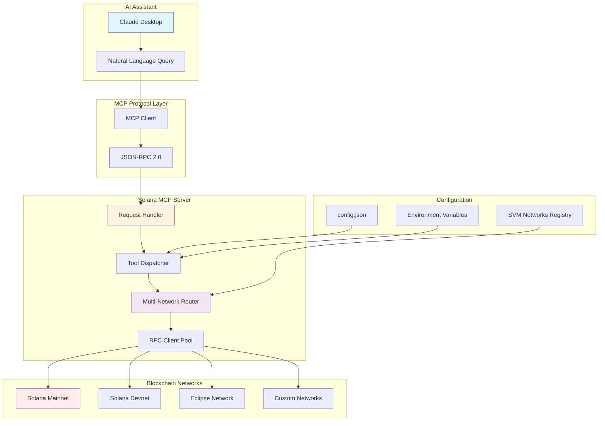
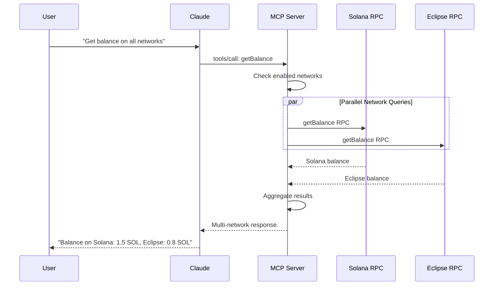

# Solana MCP Server Documentation

## Table of Contents

1. [Developer Onboarding Guide](./ONBOARDING.md) - **New contributors start here!**
2. [Architecture Overview](./ARCHITECTURE.md)
3. [Deployment Guide](./DEPLOYMENT.md)
4. [API Reference](./API_REFERENCE.md)
5. [Configuration Guide](./CONFIGURATION.md)
6. [Examples and Use Cases](./EXAMPLES.md)

## Quick Overview

The Solana MCP Server is a comprehensive Model Context Protocol implementation that provides seamless access to Solana blockchain data through AI assistants like Claude. It features multi-network support, extensive RPC method coverage, and flexible deployment options.

## Key Features

### 🚀 Comprehensive RPC Coverage
- **47 Solana RPC methods** across all major categories
- **4 network management methods** for multi-SVM support
- **Real-time blockchain data** with configurable commitment levels

### 🌐 Multi-Network Support
- Query multiple SVM-compatible networks simultaneously
- Dynamic network configuration and management
- Parallel execution with result aggregation

### 🛠️ Flexible Deployment
- Local development with Claude Desktop
- HTTP endpoint deployment
- Serverless functions (AWS Lambda, Vercel, Google Cloud)
- Container orchestration (Docker, Kubernetes)

### ⚡ High Performance
- Connection pooling and persistent RPC clients
- Configurable caching layers
- Parallel multi-network queries
- Built-in rate limiting and error recovery

## Architecture Overview



## Getting Started

### 1. Quick Installation
```bash
# Download and configure automatically
curl -s https://api.github.com/repos/opensvm/solana-mcp-server/releases/latest | \
grep browser_download_url | grep $(uname -s | tr '[:upper:]' '[:lower:]') | \
cut -d '"' -f 4 | xargs curl -L -o solana-mcp-server && \
chmod +x solana-mcp-server && \
mkdir -p ~/.config/claude && \
echo '{"mcpServers":{"solana":{"command":"'$(pwd)'/solana-mcp-server","env":{"SOLANA_RPC_URL":"https://api.mainnet-beta.solana.com"}}}}' > ~/.config/claude/config.json
```

### 2. Basic Usage
Once configured, you can interact through natural language:

- "What's the SOL balance of address `Gh9ZwEmdLJ8DscKNTkTqPbNwLNNBjuSzaG9Vp2KGtKJr`?"
- "Show me the current slot number"
- "Get the token supply for USDC"
- "List all available SVM networks"

### 3. Multi-Network Setup
```bash
# Enable additional networks
"Enable Eclipse mainnet network"
"Set a custom RPC URL for development testing"
```

## Documentation Structure

### [Architecture Overview](./ARCHITECTURE.md)
Comprehensive guide to the server's internal architecture, components, and data flow patterns.

**Topics Covered:**
- System architecture diagrams
- Core component interactions
- Request/response flow
- Multi-network routing
- Security model
- Performance characteristics

### [Deployment Guide](./DEPLOYMENT.md)
Step-by-step instructions for deploying the server in various environments.

**Deployment Options:**
- Local development setup
- HTTP endpoint deployment
- Serverless functions (AWS Lambda, Vercel, Google Cloud)
- Container orchestration
- Production configuration
- Monitoring and observability

### [API Reference](./API_REFERENCE.md)
Complete documentation of all available RPC methods and network management features.

**Method Categories:**
- Network Management (4 methods)
- Account Methods (6 methods)
- Block Methods (9 methods)
- System Methods (6 methods)
- Epoch and Inflation Methods (5 methods)
- Token Methods (5 methods)
- Transaction Methods (6 methods)
- Other Methods (6 methods)

### [Configuration Guide](./CONFIGURATION.md)
Detailed configuration options, formats, and best practices.

**Configuration Topics:**
- Configuration file formats
- Environment variables
- Network management
- Security settings
- Performance tuning
- Development vs production configs

### [Examples and Use Cases](./EXAMPLES.md)
Practical examples and real-world use cases for the Solana MCP Server.

**Example Categories:**
- Basic account and token operations
- Multi-network queries and comparisons
- DeFi portfolio analysis
- Development workflows
- Integration patterns
- Error handling scenarios

## Network Support

The server supports querying multiple SVM-compatible networks:

| Network | Status | Default RPC |
|---------|--------|-------------|
| Solana Mainnet | ✅ Supported | api.mainnet-beta.solana.com |
| Solana Devnet | ✅ Supported | api.devnet.solana.com |
| Eclipse Mainnet | ✅ Supported | mainnetbeta-rpc.eclipse.xyz |
| Custom Networks | ✅ Supported | User-configurable |

## Request Flow



## Performance Metrics

| Metric | Single Network | Multi-Network |
|--------|---------------|---------------|
| Latency | 100-500ms | 200-800ms |
| Throughput | 100 req/min | 50 req/min |
| Memory Usage | ~10MB | ~15MB |
| CPU Usage | Minimal | Low |

## Contributing

We welcome contributions! Please see our contributing guidelines for:
- Code style and standards
- Testing requirements
- Documentation updates
- Feature requests and bug reports

## Support

For support and questions:
- 📖 Documentation: This documentation set
- 🐛 Issues: GitHub Issues
- 💬 Discussions: GitHub Discussions
- 📧 Contact: [Maintainer contact information]

## License

This project is licensed under the MIT License. See the LICENSE file for details.